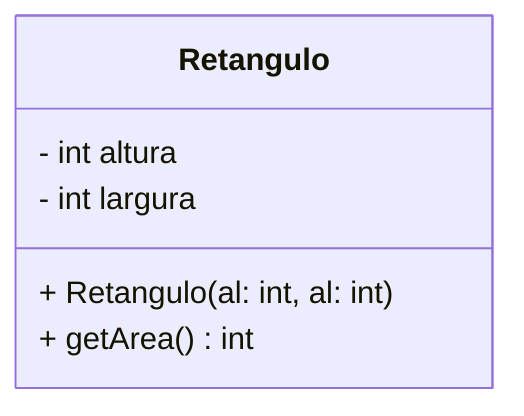
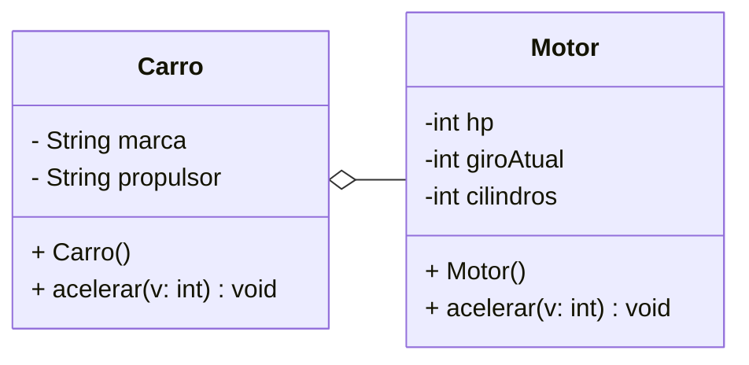

# Diagrama de classes UML

## Código Java
```java
public class Pessoa{
    private String nome;
}
```

## Diagrama UML


```mermaid
classDiagram
    class Retangulo{
        - int altura
        - int largura
        + Retangulo(al: int, al: int)
        + getArea() int
     }
```


```mermaid
classDiagram
    direction LR
    Carro o-- Motor
    class Carro{
        - String marca
        - String propulsor
        + Carro()
        + acelerar(v: int) void
        
    } 
    class Motor{
        -int hp
        -int giroAtual
        -int cilindros
        + Motor() 
        + acelerar(v: int) void}
        
```