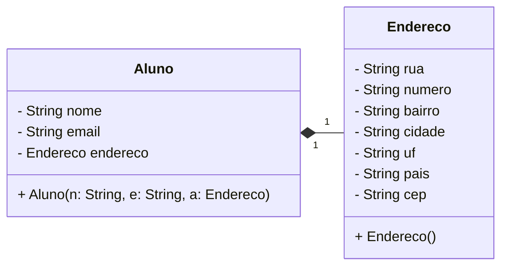

```mermaid
classDiagram
    class Aluno{
        - String nome
        - String email
        - Endereco endereco
        + Aluno(n: String, e: String, a: Endereco)
        
    }
    
    class Endereco{
        - String rua
        - String numero
        - String bairro
        - String cidade
        - String uf
        - String pais
        - String cep
        + Endereco()
    }
    
Aluno "1"*--"1" Endereco
direction LR
```