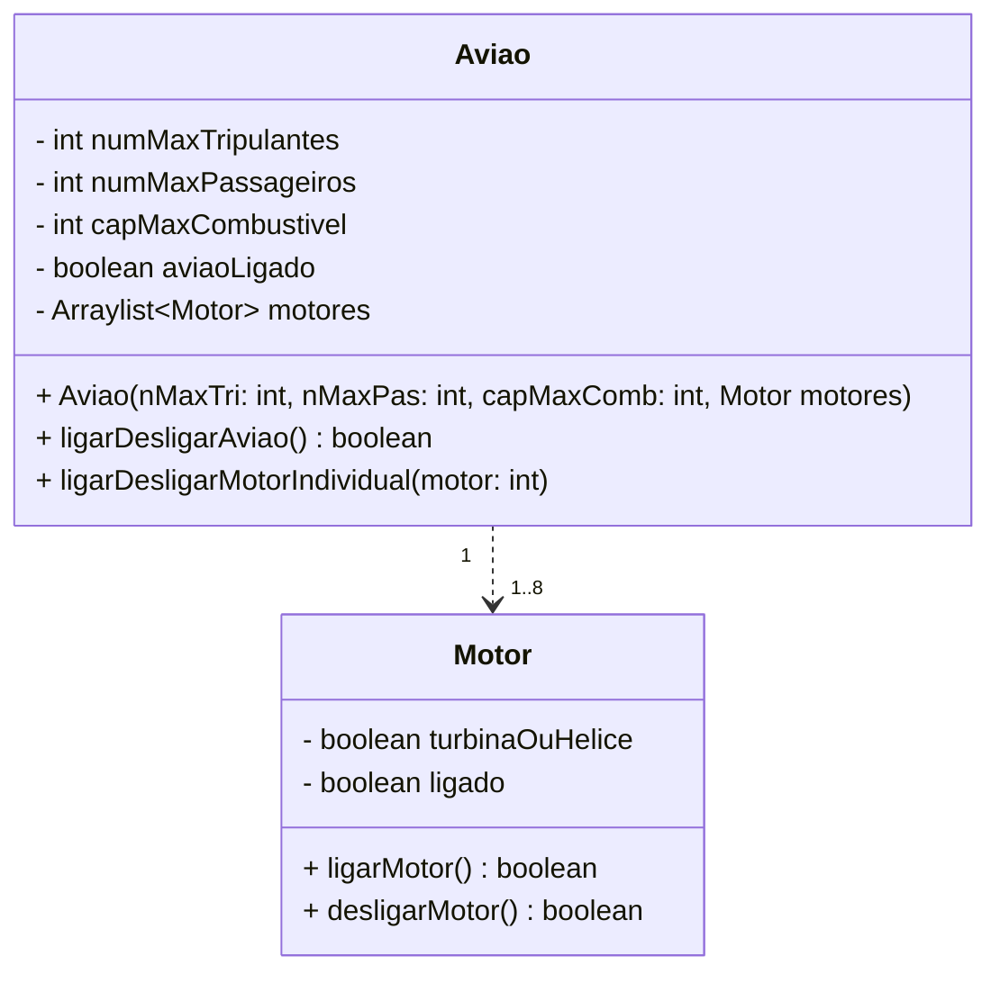

```mermaid
classDiagram
    class Aviao{
        - int numMaxTripulantes
        - int numMaxPassageiros
        - int capMaxCombustivel
        - boolean aviaoLigado
        - Arraylist~Motor~ motores
        + Aviao(nMaxTri: int, nMaxPas: int, capMaxComb: int, Motor motores)
        + ligarDesligarAviao() boolean
        + ligarDesligarMotorIndividual(motor: int)
    }
    
    class Motor{
        - boolean turbinaOuHelice
        - boolean ligado
        + ligarMotor() boolean
        + desligarMotor() boolean
    }
Aviao "1" ..> "1..8" Motor 
```