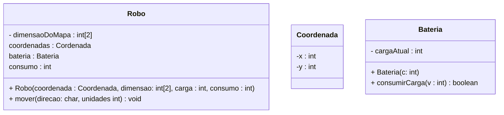

```mermaid
classDiagram
    class Robo{
        - dimensaoDoMapa : int[2]
        coordenadas : Cordenada
        bateria : Bateria
        consumo : int
        + Robo(coordenada : Coordenada, dimensao: int[2], carga : int, consumo : int )
        + mover( direcao: char, unidades int) void
    }

class Coordenada{
    -x : int
    -y : int
}

class Bateria{
        - cargaAtual : int
        + Bateria(c: int)
        + consumirCarga(v : int) boolean
        
 }

```