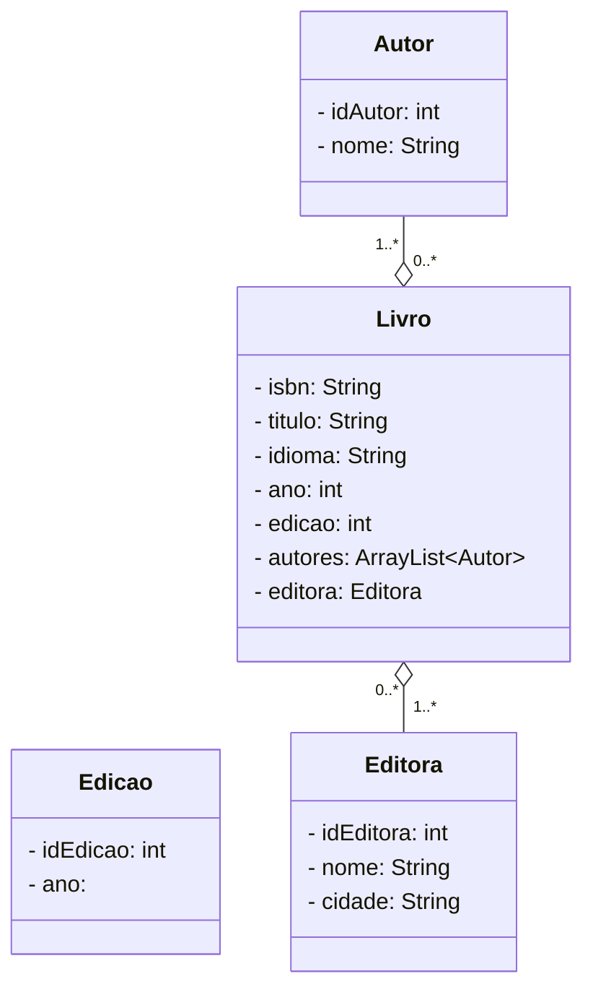
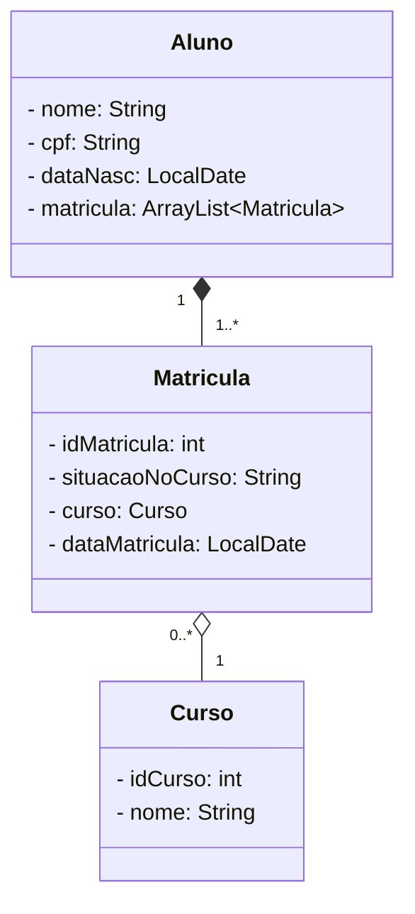
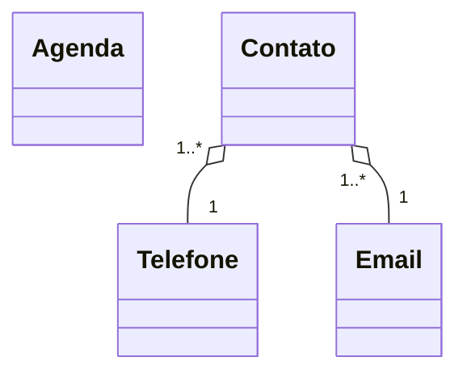

```mermaid
classDiagram
class Autor{
    - idAutor: int
    - nome: String
}
direction BT
Livro "0..*" o-- "1..*" Autor
class Livro{
    - isbn: String
    - titulo: String
    - idioma: String
    - ano: int
    - edicao: int
    - autores: ArrayList~Autor~
    - editora: Editora
}
class Edicao{
    - idEdicao: int
    - ano: 
 }
Editora "1..*" --o "0..*" Livro
class Editora{
    - idEditora: int
    - nome: String
    - cidade: String
}
```

```mermaid
classDiagram
    class Aluno{
        - nome: String
        - cpf: String
        - dataNasc: LocalDate
        - matricula: ArrayList~Matricula~
    }
    
    Matricula "0..*" o-- "1" Curso
    
    Aluno "1" *-- "1..*" Matricula
    direction TB
    class Matricula{
    - idMatricula: int
    - situacaoNoCurso: String
    - curso: Curso
    - dataMatricula: LocalDate
    }
    
    class Curso{
        - idCurso: int
        - nome: String
    }
```

```mermaid
classDiagram
    class Agenda{
        
    }
    
    class Contato{
        
    }
    
    class Telefone{
        
    }
    class Email{
        
    }
    
    Contato "1..*" o-- "1" Telefone
    Contato "1..*" o-- "1" Email
    
    
```
