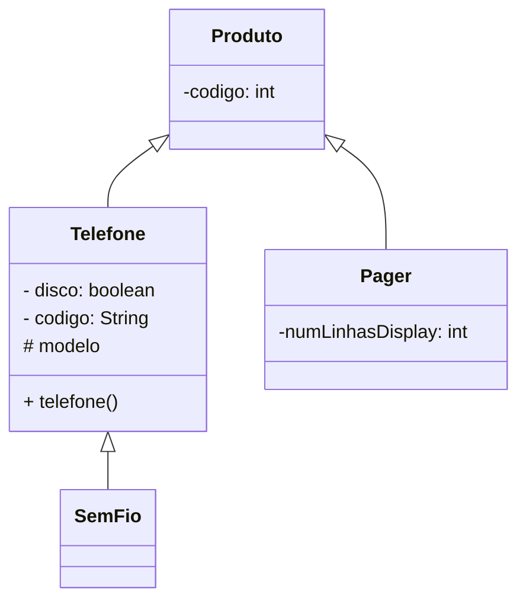

```mermaid
classDiagram
    direction BT
    
    class Produto{
        -codigo: int
    }
    
    
    class Telefone{
        - disco: boolean
        - codigo: String
        # modelo
        + telefone()
    }
    
    class Pager{
        -numLinhasDisplay: int
    }
    
    class SemFio{
        
    }
    
    Telefone --|> Produto
    Pager --|> Produto
    SemFio --|> Telefone
```