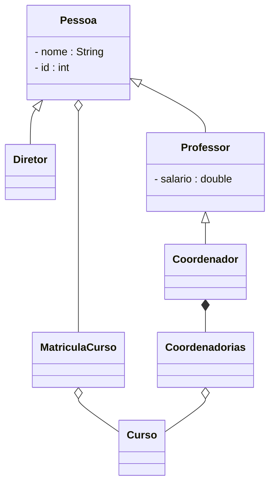
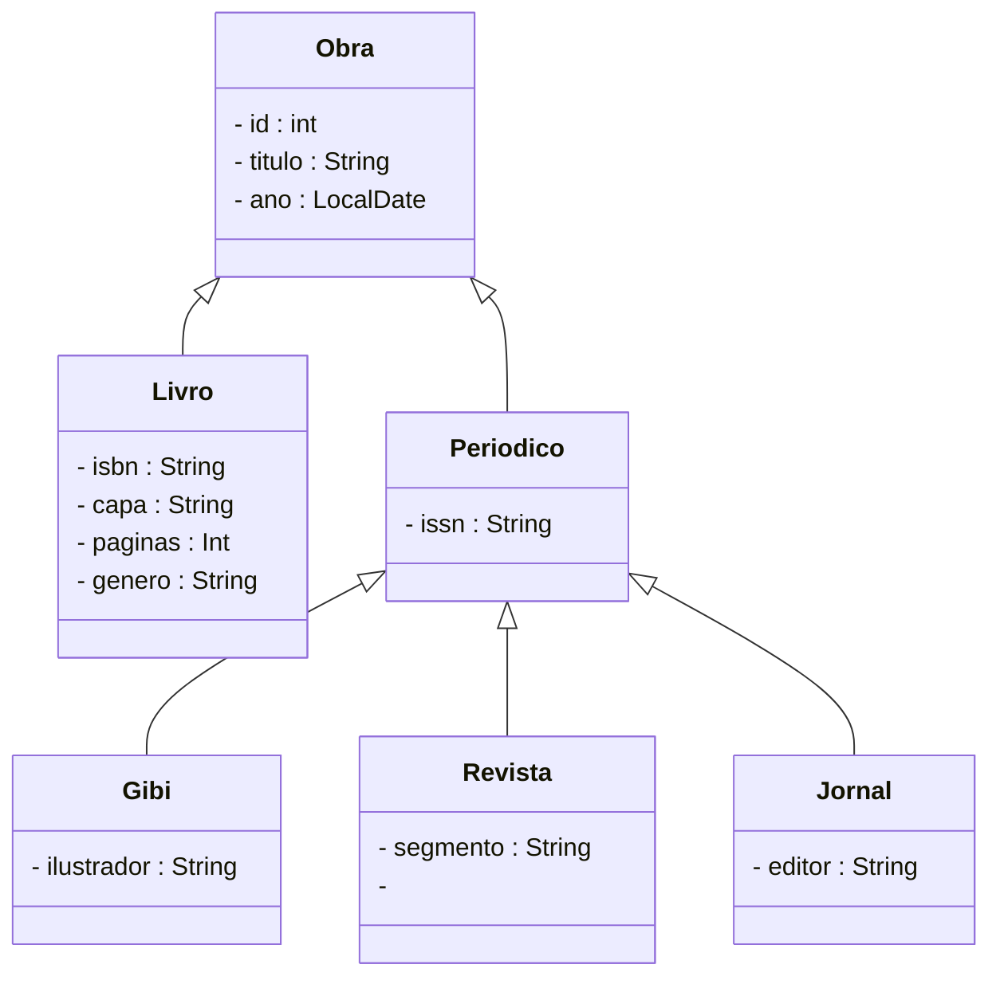
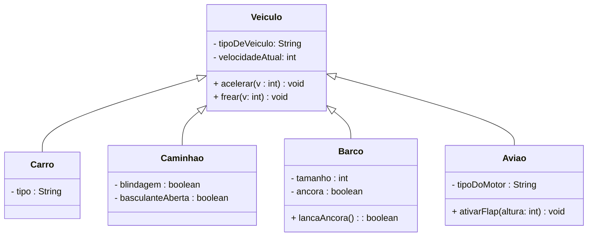

```mermaid
classDiagram
    class Diretor{
        
    }
    
    class Coordenador{
        
    }
    
    class Professor{
        - salario : double
    }
    
    class Pessoa{
        - nome : String
        - id : int
    }
    

Pessoa <|-- Diretor
Pessoa <|-- Professor
Pessoa o-- MatriculaCurso
MatriculaCurso o-- Curso
Professor <|-- Coordenador
Coordenador *-- Coordenadorias
Coordenadorias o-- Curso


```

```mermaid
classDiagram
    
    class Obra{
        - id : int
        - titulo : String
        - ano : LocalDate
    }
    
    class Livro{
        - isbn : String
        - capa : String
        - paginas : Int
        - genero : String
    }
    class Periodico{
        - issn : String
    }
    
    class Revista{
        - segmento : String
        -
    }
    
    class Jornal{
        - editor : String 
    }
    
    class Gibi{
        - ilustrador : String
    }
    
    Obra <|-- Livro
    Obra <|-- Periodico
    Periodico <|-- Gibi
    Periodico <|-- Revista
    Periodico <|-- Jornal
    
```

```mermaid
classDiagram
    class Veiculo{
        - tipoDeVeiculo: String
        - velocidadeAtual: int
        + acelerar(v : int) void
        + frear(v: int) void
    }
    
    class Carro{
        - tipo : String
        
    }
    class Caminhao{
        - blindagem : boolean
        - basculanteAberta : boolean
    }
    
    class Barco{
        - tamanho : int
        - ancora : boolean
        + lancaAncora(): boolean
    }
    class Aviao{
        - tipoDoMotor : String
        + ativarFlap(altura: int) void
    }
    
    Veiculo <|-- Carro
    Veiculo <|-- Caminhao
    Veiculo <|-- Barco
    Veiculo <|-- Aviao
```