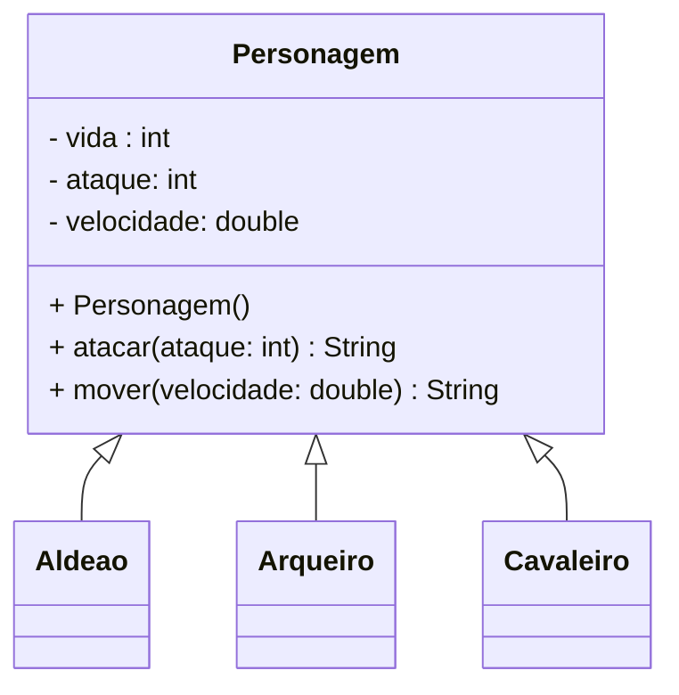

```mermaid
classDiagram
    class Personagem{
        - vida : int
        - ataque: int
        - velocidade: double
        + Personagem()
        + atacar(ataque: int) String
        + mover(velocidade: double) String
    }
    class Aldeao{
        
    }
    class Arqueiro{
        
    }
    class Cavaleiro{
        
    }
    
    Personagem <|-- Aldeao
    Personagem <|-- Arqueiro
    Personagem <|-- Cavaleiro
```