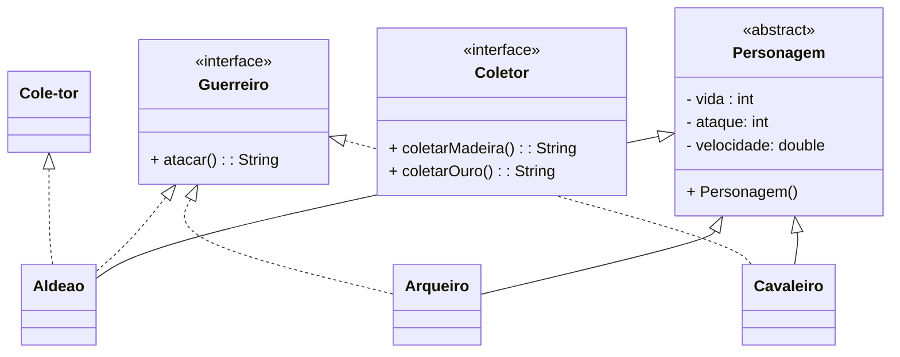

```mermaid
classDiagram
    class Personagem{ 
        <<abstract>>
        - vida : int
        - ataque: int
        - velocidade: double
        + Personagem() 
        }
    
    class Aldeao{ 
        
    }
    
    class Arqueiro{
        }
        
    class Cavaleiro{
        }

    class Guerreiro{
        <<interface>>
        + atacar(): String 
        }

    class Coletor{
        <<interface>>
        + coletarMadeira(): String
        + coletarOuro(): String 
        }
    
    Personagem <|-- Aldeao
    Personagem <|-- Arqueiro
    Personagem <|-- Cavaleiro
    Guerreiro <|.. Cavaleiro
    Guerreiro <|.. Arqueiro
    Guerreiro <|.. Aldeao
    Cole-tor <|.. Aldeao
```