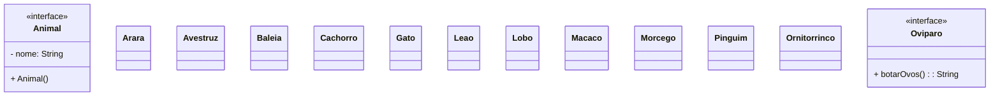

```mermaid
classDiagram
class Animal{
<<interface>>
- nome: String
+ Animal()
}

    class Arara{
    
    }

    class Avestruz{
    
    }

    class Baleia{
    
    }

    class Cachorro{
    
    }

    class Gato{
    
    }

    class Leao{
    
    }

    class Lobo{
    
    }

    class Macaco{
    
    }

    class Morcego{
    
    }

    class Pinguim{
    
    }

    class Ornitorrinco{
    
    }

    class Oviparo{
    <<interface>>
    + botarOvos(): String
    }
```