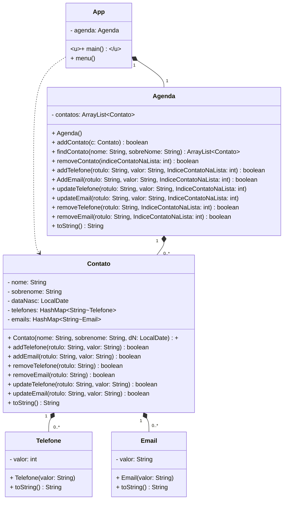

```mermaid
classDiagram
    
    class App{
        - agenda: Agenda
        <u>+ main()</u>
        + menu()
    }
    class Agenda{
        - contatos: ArrayList~Contato~
        + Agenda()
        + addContato(c: Contato) boolean
        + findContato(nome: String, sobreNome: String) ArrayList~Contato~
        + removeContato(indiceContatoNaLista: int) boolean
        + addTelefone(rotulo: String, valor: String, IndiceContatoNaLista: int) boolean
        + AddEmail(rotulo: String, valor: String, IndiceContatoNaLista: int) boolean
        + updateTelefone(rotulo: String, valor: String, IndiceContatoNaLista: int )
        + updateEmail(rotulo: String, valor: String, IndiceContatoNaLista: int)
        + removeTelefone(rotulo: String, IndiceContatoNaLista: int) boolean
        + removeEmail(rotulo: String, IndiceContatoNaLista: int) boolean
        + toString() String
        
    }
    
    class Contato{
        - nome: String
        - sobrenome: String
        - dataNasc: LocalDate
        - telefones: HashMap~String~Telefone~
        - emails: HashMap~String~Email~
        + Contato(nome: String, sobrenome: String, dN: LocalDate)+
        + addTelefone(rotulo: String, valor: String) boolean
        + addEmail(rotulo: String, valor: String) boolean
        + removeTelefone(rotulo: String) boolean
        + removeEmail(rotulo: String) boolean
        + updateTelefone(rotulo: String, valor: String) boolean
        + updateEmail(rotulo: String, valor: String) boolean
        + toString() String
    }
    
    class Telefone{
        - valor: int
        + Telefone(valor: String)
        + toString() String
        
    }
    class Email{
        - valor: String
        + Email(valor: String)
        + toString() String
    }
    
    App ..> Contato
    App "1" *-- "1" Agenda
    Agenda "1" *-- "0..*" Contato
    Contato "1" *-- "0..*" Telefone
    Contato "1" *-- "0..*" Email
    
    
```
